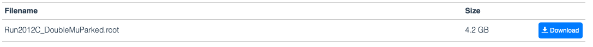

## Getting started

### Download data files

In this exercise we will analyze data recorded by the Compact muon Solenoid (CMS) experiment at the Large Hadron Collider (LHC).
The data is stored in binary files in what is called the "root" format.
Start by downloading the following files:

 - `SMHiggsToZZTo4L.root` from http://opendata.cern.ch/record/12361
 - `ZZTo4mu.root` from http://opendata.cern.ch/record/12362
 - `Run2012B_DoubleMuParked.root` from http://opendata.cern.ch/record/12365
 - `Run2012C_DoubleMuParked.root` from http://opendata.cern.ch/record/12366

 On each page there is a description of the contents of the file, and the download link is at the end of the page:

 

Note that the total download is around 7 GB, so make sure you have enough space!

### Notebook software

Install the JupyterLab desktop software following the instructions for your operating system on https://github.com/jupyterlab/jupyterlab-desktop.

When first opening JupyterLab, it may ask if you want to install a local python release - if so, select yes.

We will need to use some extra python packages for the exercise. To install these, open and run the `Setup.ipynb` notebook in JupyterLab. You should see the modules being installed.
Next, try to run the `FirstTest.ipynb` notebook - see if you can make the Higgs boson invariant mass distribution.