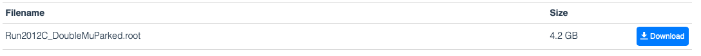
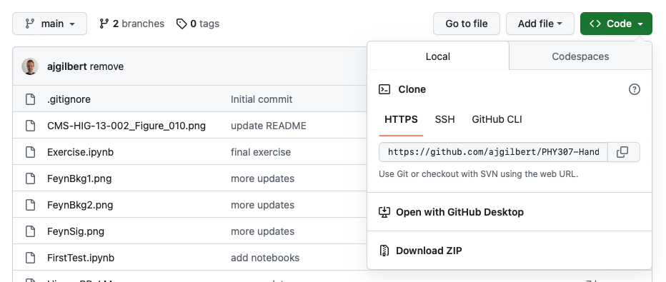

## Getting started

In this exercise we will analyze data recorded by the Compact muon Solenoid (CMS) experiment at the Large Hadron Collider (LHC).
In 2012, after two years of data taking, the ATLAS and CMS experiments reported the observation of a new particle with a mass around 125 GeV, later established to be the Higgs boson. The Higgs boson, when produced in a high energy collision, decays almost immediately into other particles. One of the main decay channels used to establish the existence of the Higgs boson is the decay to a pair of Z bosons, which themselves decay to pairs of electrons or muons. This is a very clean signature, and one can see the visible peak in the four-lepton invariant mass distribution caused by the Higgs boson.

The goal of this exercise is to recreate the $H\rightarrow ZZ \rightarrow 4l$ analysis, using actual CMS data and Monte Carlo simulation, and then attempt to identify the Higgs boson, as in the figure below.

### Download data files

The data is stored in binary files in what is called the "root" format.
Start by downloading the following files:

 - `SMHiggsToZZTo4L.root` from http://opendata.cern.ch/record/12361
 - `ZZTo4mu.root` from http://opendata.cern.ch/record/12362
 - `Run2012B_DoubleMuParked.root` from http://opendata.cern.ch/record/12365
 - `Run2012C_DoubleMuParked.root` from http://opendata.cern.ch/record/12366

 On each page there is a description of the contents of the file, and the download link is at the end of the page:

 

Note that the total download is around 7 GB, so make sure you have enough space!

### Notebook software

Install the JupyterLab desktop software following the instructions for your operating system on https://github.com/jupyterlab/jupyterlab-desktop.

When first opening JupyterLab, it may ask if you want to install a local python release - if so, select yes.

### Download the notebooks

It's important to download the whole git repository - the easiest way is to download the zip file:

then unzip somewhere on your computer and copy the four .root files above into the same location.

With that done, we will need to use some extra python packages for the exercise. To install these, open and run the `Setup.ipynb` notebook in JupyterLab. You should see the modules being installed.

After that, you can work through `Exercise.ipynb`.
